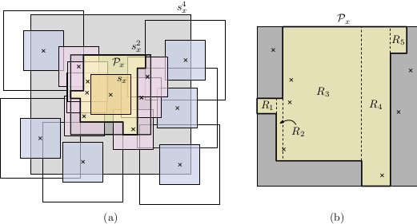

## Overview

The independent set problem is a fundamental graph problem with a wide range of applications. Given a graph $$G = (V, E)$$, a set of vertices $$M \subset V$$ is independent if no two vertices in $$M$$ are adjacent in $$G$$. A maximal independent set (**MIS**) is an independent set that
is not a proper subset of any other independent set. A maximum independent set (**Max-IS**) is a maximum cardinality independent set. While Max-IS is one of Karp’s 21 classic NP-complete problems, computing a MIS can easily be done by a simple greedy algorithm in
$$O(|E|)$$ time. The **MIS** problem has been studied in the context of several other prominent
problems, e.g., graph coloring, maximum matching, and vertex cover. On the
other hand, Max-IS serves as a natural model for many real-life optimization problems,
including map labeling, computer vision, information retrieval, and scheduling.

This is the open source project DynaMIS---a dynamic maximum independent solver developed at the  Institute of Logic and Computation, TU Wien, Vienna, Austria.
So far our framework contains a deterministic algorithm for maintaining a **MIS** (and thus a $$4$$-approximate **Max-IS**) of a dynamic set of uniform rectangles with amortized sub-logarithmic update time. This breaks the natural barrier of $$\Omega(\Delta)$$ update time, where $$\Delta$$ is the maximum degree in the graph. We also provide a series of deterministic dynamic approximation schemes for maintaining a **Max-IS**. The algorithm **GRID** maintains a $$4$$-approximate **Max-IS** with $$O(1)$$ update time. Its derived algorithm **GRID-K** establishes the trade-off between approximation quality $$2(1+\frac{1}{k})$$ and update time  $$O(k^2\log n)$$. Our framework also includes an algorithm that maintains unit interval graphs. With this algorithm,  a $$2$$-approximate **Max-IS** for dynamic sets of unit-height rectangles with $$O(\omega \log n)$$ update time can be maintained, where $$\omega$$ is the maximum size of an independent set of the rectangles stabbed by any horizontal line.  

  

    
  

  

     
  

## Licence

This project is under MIT licence. 
## Reference
If you want to know more about our implemented algorithms, please refer to our paper: 
**Algorithmic Study of Fully Dynamic Independent Sets for Map Labeling** 
Sujoy Bhore, Guangping Li, Martin Nöllenburg 
Algorithms (ESA'20) (Fabrizio Grandoni, Peter Sanders, eds.), volume 173 of LIPIcs, pages 19:1–19:24, 2020, Schloss Dagstuhl – Leibniz-Zentrum für Informatik. 
[[bibtex]](https://www.ac.tuwien.ac.at/publications/bln-asfdisl-20?file=../../publications/noellenburg-ac-web.bib) [[pdf]](https://arxiv.org/abs/2002.07611) [[doi]](https://dx.doi.org/10.4230/LIPIcs.ESA.2020.19)

Please acknowledge our work if you publish your result using our algorithms or code.

## Download
Source code and benchmark instances (available in this [github repository](https://github.com/GPLi-TUWIEN/dynaMIS))

Benchmark data generator for point features (available in this [github repository](https://github.com/dyna-mis/labeling-instance-generator))

## Support
Please write us an [Email](mailto:guangping@ac.tuwien.ac.at) if you have questions.

We are glad to get any comments and error reports.

A random instance generator is available upon request.
## Acknowledgments
DynaMIS is part of the project ["Human-Centered Algorithm Engineering: Graph and Map Visualization"](https://www.ac.tuwien.ac.at/research/humalgo/) supported by the Austrian Science Fund (FWF) under Grant P31119.
